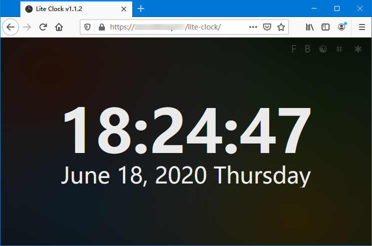

# lite-clock

低功耗网页时钟，适用于旧机常亮展示。

功能：

- 支持 ServiceWorker，离线可用
- 适配各种尺寸的屏幕
- 精确的时钟更新，使用原生js编写
- 时钟多国语言支持（moment.js）
- 全屏模式切换
- 黑白主题切换
- Bing 壁纸主题切换，支持自动更新 Bing 壁纸和简介，点击简介可下载原图
- 字体大小调整




## 构建

```
# 安装依赖
yarn
# 或 npm install

# 开发
npm run start

# 构建生产
npm run build 
```

## Bing 壁纸API nginx 跨域代理

```
server {
  listen 9003;
  server_name localhost;

  location / {
    add_header 'Access-Control-Allow-Origin' '*';
    add_header 'Access-Control-Allow-Credentials' 'true';
    add_header 'Access-Control-Allow-Headers' 'Authorization,Accept,Origin,DNT,X-CustomHeader,Keep-Alive,User-Agent,X-Requested-With,If-Modified-Since,Cache-Control,Content-Type,Content-Range,Range';
    add_header 'Access-Control-Allow-Methods' 'GET,POST,OPTIONS,PUT,DELETE,PATCH';

    if ($request_method = 'OPTIONS') {
      add_header 'Access-Control-Allow-Origin' '*';
      add_header 'Access-Control-Allow-Credentials' 'true';
      add_header 'Access-Control-Allow-Headers' 'Authorization,Accept,Origin,DNT,X-CustomHeader,Keep-Alive,User-Agent,X-Requested-With,If-Modified-Since,Cache-Control,Content-Type,Content-Range,Range';
      add_header 'Access-Control-Allow-Methods' 'GET,POST,OPTIONS,PUT,DELETE,PATCH';
      add_header 'Access-Control-Max-Age' 1728000;
      add_header 'Content-Type' 'text/plain charset=UTF-8';
      add_header 'Content-Length' 0;
      return 204;
    }

    proxy_redirect off;
	proxy_set_header   Host     www.bing.com;
    proxy_set_header   X-Real-IP        $remote_addr;
    proxy_set_header   X-Forwarded-For  $proxy_add_x_forwarded_for;
    proxy_pass http://www.bing.com;
  }
}
```
