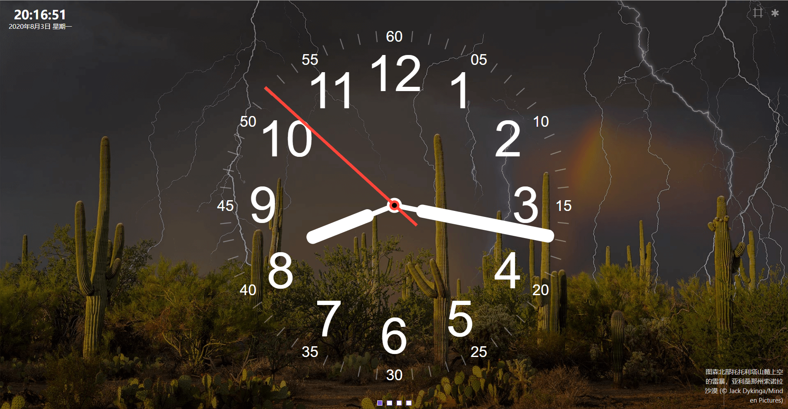
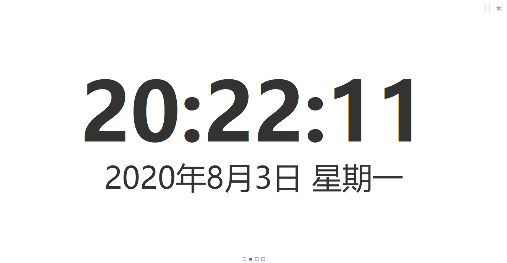
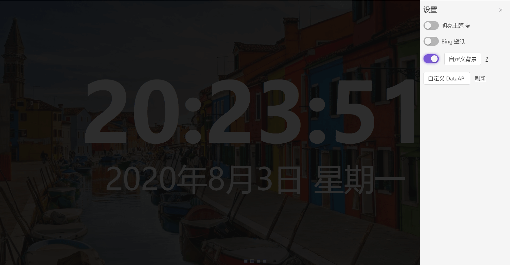

# always-on-screen

一款网页端看板应用，适合屏幕常亮显示








## 特性

- 模拟时钟
- 数字时钟
- 横向文字跑马灯
- 黑白主题
- Bing壁纸背景
- 背景自定义
- 自定义 data.json

## Project setup
```
yarn install
```

### Compiles and hot-reloads for development
```
yarn serve
```

### Compiles and minifies for production
```
yarn build
```

### Customize configuration
See [Configuration Reference](https://cli.vuejs.org/config/).
